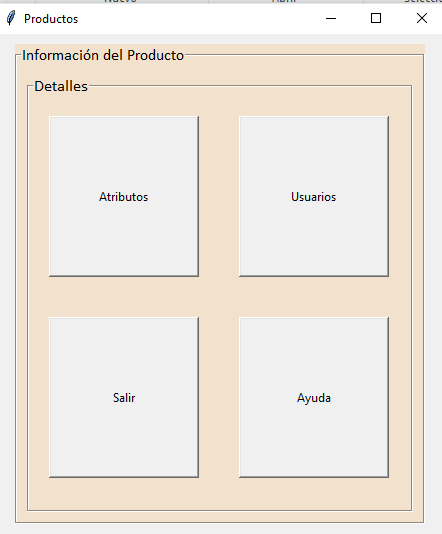

**Introducción:**

En este código, exploramos cómo trabajar con la biblioteca Tkinter en Python para crear interfaces gráficas de usuario (GUI). Tkinter es una herramienta poderosa y fácil de usar que nos permite crear ventanas, botones, etiquetas y otros elementos de interfaz para nuestras aplicaciones.

En este ejemplo específico, estamos desarrollando una aplicación que consiste en varias ventanas que se abren y cierran según las acciones del usuario. Estas ventanas se gestionan utilizando la clase `Menu`. Cada ventana se crea como una instancia de la clase `Toplevel`, que es una ventana secundaria que puede contener elementos de interfaz adicionales.

El objetivo principal de esta aplicación es permitir al usuario interactuar con diferentes partes de la aplicación a través de ventanas independientes. Por ejemplo, podemos tener una ventana para mostrar atributos, otra para administrar usuarios y una tercera para proporcionar ayuda al usuario.

Además, hemos implementado una funcionalidad para confirmar la salida de la aplicación. Cuando el usuario intenta cerrar la ventana principal, se muestra un cuadro de diálogo que pregunta si está seguro de que desea salir. Esto ayuda a prevenir cierres accidentales y permite al usuario confirmar su elección antes de finalizar la aplicación.

En resumen, este código muestra cómo utilizar Tkinter para crear una aplicación con múltiples ventanas y cómo interactuar con el usuario a través de diálogos de confirmación. Es un ejemplo útil para comprender cómo estructurar y gestionar aplicaciones con interfaces gráficas en Python.

